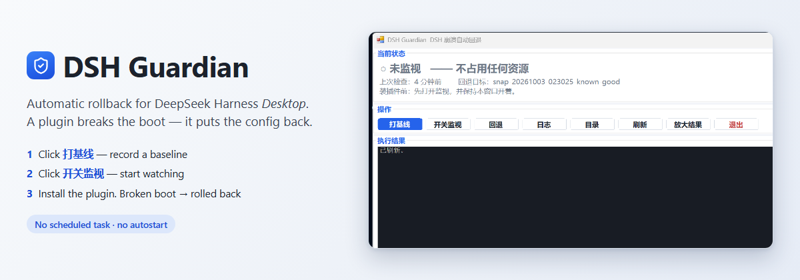
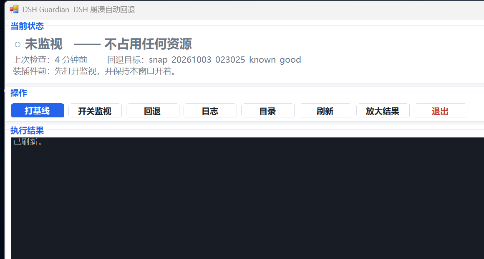

# DSH Guardian

**给 DeepSeek Harness（DSH）*桌面版*用的崩溃自动回退工具。**

装插件把 DSH 搞崩了？它会自动把配置退回上一个能用的版本、把依赖重新装好、再把 DSH 拉起来。

> [English](README.md) · 中文 · [完整使用说明](docs/GUIDE-zh.md) · [图形界面说明](docs/GUI.md) · [日志怎么读](docs/LOG.md) · [技术文档](docs/TECHNICAL.md)



**Windows** · **DSH 桌面版** · **MIT** · **无计划任务、无自启**

---

## 新手 3 步上手

刚用上 DSH、准备装插件？整个流程就这么多：

1. **先装好 DSH 桌面版，并启动过一次。** 本工具依赖它，而且需要先有一个"好版本"可退。
2. **解压到固定位置，双击 `app\dsh-guardian.exe`**（图形界面）。没有安装程序、不写注册表、不会自动建快捷方式。详细说明见 [docs/GUI.md](docs/GUI.md)。
3. **点「打基线」记一个基线，再点「开关监视」开始自动检查，窗口保持开着。** 然后去装插件。

装完之后：DSH 能正常启动 → 再点一次「打基线」（记新基线）→ 点「开关监视」关闭检查 → 关窗口。完事。



> **监视在独立进程里跑**：打开监视后可以关掉界面，它照常工作；要停止就再点一次界面的「开关监视」。

| 想知道 | 点 |
|---|---|
| DSH 崩了，为什么、崩在哪 | 「日志」（**永远先看这个**） |
| 现在回退，或指定以后退到哪 | 「回退」 |
| 到底有没有真的抓到东西 | 看 `data\console\`，每次启动一个日志 |
| 出问题要交材料 | 桌面「DSH Guardian 诊断」快捷方式 |

---

## 新手常见问题

**崩溃之后它多久才动手？**
**默认约 90 秒再加一轮。** 一次启动必须等完整整 `-BootWindowSeconds` 窗口（默认 90 秒）才会被算作"短命启动"——这是为了不把"启动慢但没事"误判成崩溃。所以一个**瞬间就死**的 DSH，在这 90 秒里日志仍然显示 `DSH starting`，自动回退要再等一轮才触发。现在它会每 30 秒写一行"仍在启动窗口内，暂未下结论"，不会看起来像卡住。嫌慢就把 `-BootWindowSeconds` 调小（例如 `10`），前提是你的 DSH 正常情况下不会真的需要那么久才能占住端口。

**我不装插件，需要它吗？**
不需要。它只防"装插件导致 DSH 起不来"这一种情况。不碰插件的话，它对你没有任何作用。

**命令行装的 DSH 能用吗？**
不能，只针对**桌面版**。因为修复依赖这一步要调用桌面版自带的 pnpm，那个路径只存在于桌面版安装目录里。原因见下面的适用范围。

**"基线"到底是什么？**
就是 DSH 还能正常工作时，那几个配置文件的副本。点一次「打基线」存一份，旧的**永不覆盖**。自动回退只用其中一份——界面上「回退目标」那行显示的那个。

**我一直不打基线会怎样？**
它会**拒绝回退并明确告诉你**，不会瞎猜。没有基线就没有可退的版本。

**会不会和 DSH 冲突、拖慢它？**
不会。平时完全不存在：没有计划任务、不开机自启、关掉窗口后没有任何后台进程。开着的时候也只是按间隔做一次 TCP 端口探测；只有在"启动崩溃循环被证实"之后才会重启 DSH（默认连续 3 次启动都在 45 秒内死掉，或者重启次数用尽）。

**不想用了直接删？**
可以，删掉文件夹不留任何残留。你的 DSH 保持原样——除非你真的触发过一次回退，那正是它的用途。

**东西都存在哪？**
全在程序旁边的 `data\` 里：快照、日志、崩溃证据、诊断报告。它**从不读取**你的会话和凭据。

---

## 给 DSH **桌面版**用的

**本工具面向 DeepSeek Harness 的*桌面版*（Windows 上安装的那个 Electron 应用），针对 `desktop` 这个 profile。**

它**不是**通用 DSH 工具，当通用工具用会不工作：

| | |
|---|---|
| 适用对象 | `desktop` profile，位于 `%USERPROFILE%\.dsh\profiles\desktop` |
| 适用平台 | **仅 Windows**（用到 `AllocConsole`、`MessageBoxW`、`WScript.Shell`） |
| 还需要 | Windows PowerShell 5.1（系统自带） |
| **不适用** | DSH 命令行安装，或任何不由桌面版管理的 profile |

之所以是桌面版专用，关键在**依赖对齐**这一步。DSH 命令行**拒绝**碰桌面版管理的 profile：

```
dsh plugin --profile desktop install   ->  被拒绝（"由 Electron 应用独占管理"）
```

所以 DSH Guardian 不走命令行，而是调用**桌面版自带的 pnpm**
（`resources\runtime\pnpm\dist\pnpm.mjs`，配合运行时自带的 `node.exe`），在 profile 目录里执行。
这个路径只存在于桌面版安装目录里——这正是本工具围绕它构建的原因。

如果你用的是别的 DSH 布局，它保护的那套配置
（`package.json`、`pnpm-lock.yaml`、`cordis.patch.yml`、`cordis.yml`、
`pnpm-workspace.yaml`、`compatibility.json`）思路仍然适用，但**依赖对齐那一步需要换成你自己的命令**。

---

## 这是什么

DSH 装插件是直接改配置文件的。插件有问题时，DSH 可能**启动即崩溃**，而 DSH 自己没有回退机制——你只能手动去翻 `package.json`、`pnpm-lock.yaml`，猜是哪个插件的问题。

**DSH Guardian 补上这一环。** 它在你装插件的那段时间盯着 DSH，一旦发现"启动就崩"的循环，就自动：

1. 抓取崩溃现场（DSH 的原始报错）
2. 把你那套坏配置**另存一份**（不会丢）
3. 恢复**上一个好版本**
4. 自动把依赖**重新装好**
5. 重启 DSH

正常情况你只会看到 DSH 自己起来了。

## 核心特点：平时完全不存在

这是硬性设计，不是"尽量"：

| | |
|---|---|
| 计划任务 | **没有** |
| 开机启动 / 注册表自启 | **没有** |
| 空闲时的常驻进程 | **没有，零内存占用** |
| 什么时候启动 | 只有你打开它、并点「开关监视」的那一刻 |
| 什么时候停止 | 你关掉那个窗口的瞬间 |

程序用 `-Resident -ParentPid <窗口进程号>` 启动监视器，**窗口一消失它自己就退出**——不可能在你不知情的情况下留在后台。

## 界面

图形界面，一行按钮，不用记任何按键：

```
当前状态   ● 监视中 —— 关掉本窗口即停止 · 上次检查 4 分钟前 · 回退目标 snap-…-known-good
操作       打基线 | 开关监视 | 回退 | 日志 | 目录 | 刷新 | 放大结果 | 退出
执行结果   点完按钮的结果都写在这里
```


## 安装

### 1. 下载

**推荐：下载打包好的压缩包**（解压即用，含 exe + 源码 + 文档）：

```
https://github.com/weiming88888/DSH-Guardian/releases/latest
```

或从源码下载仓库 ZIP：

```
https://github.com/weiming88888/DSH-Guardian/archive/refs/heads/main.zip
```

解压后会得到一个 `DSH-Guardian-<版本>\` 文件夹，把它放到任意固定位置（例如 `D:\DS\`），最终路径形如 `D:\DS\DSH-Guardian-<版本>\`。

### 2. 运行

双击 `app\dsh-guardian.exe`。

- 会弹出一个中文图形界面窗口
- **没有安装程序、不写注册表、也不会动你的桌面**
- **快捷方式不会被自动创建**。想要的话，执行一次 `dsh-guardian.exe shortcut`

### 3. 打第一个基线

在新窗口里点「打基线」，把当前"能正常启动"的状态记为第一个好版本。

**没打基线之前，自动回退没有目标可退。**

## 使用

### 日常流程（只在装插件的时候）

```
装插件之前 : 打开它，点「开关监视」开始自动检查，保持窗口开着
装完插件后 : DSH 能正常启动 → 点「打基线」记新基线
             → 点「开关监视」关闭检查 → 关掉窗口
```

**就这些。** 平时什么都不用管，因为它根本不运行。

> **窗口就是开关**：窗口开着 = 在监视；窗口关掉 = 已停止。
> 监视器用 `-ParentPid <本窗口进程号>` 启动，**窗口一消失它自己就退出**，不可能在你不知情的情况下留在后台。
> 这是设计如此，不是卡住。

### 界面上的按钮

| 按钮 | 作用 |
|---|---|
| 打基线 | 把现在这个状态记为一个"好版本"（新增一份，不覆盖旧的） |
| 开关监视 | 开关。只有"开"的时候才监视 |
| 回退 | 列出所有版本，选一个，再决定是**现在回退**还是**只作以后的目标** |
| 日志 | 看最近为什么崩、崩在哪。**出问题先点这个** |
| 目录 | 浏览 `data\`：快照、日志、诊断报告 |
| 刷新 | 重新读一遍状态 |
| 放大结果 | 收起上面的分区，让输出占满窗口 |
| 退出 | 退出（会先问监视怎么办） |


### 关于"好版本"

**可以存多个。** 每点一次「打基线」就新增一份，旧的不会被删。

但自动回退**只用其中一份**，叫"当前回退目标"，界面上那一行显示的就是它。

**什么时候需要换目标？** 假设你依次装了插件 A、插件 B，结果 B 把 DSH 搞崩了：

| 目标指向 | 回退结果 |
|---|---|
| 最新基线（装 B 之前） | **A 留下了** —— 只想干掉 B |
| 更早基线（装 A 之前） | **A、B 都没了** —— 想回到两个都没装的状态 |

点「回退」就能选，列表会标出哪份是当前生效的。

### 三道取消机会

回退流程里任何一步都能全身而退：

| 位置 | 怎么取消 | 结果 |
|---|---|---|
| 选版本的选单 | 输入 `0` 或直接回车 | 什么都不做 |
| 动作弹窗 | 点【取消】 | 什么都不做 |
| 动作弹窗 | 点【否】 | 不回退，只把它设为以后的目标 |

**手动回退永远可逆**：写盘之前，当前配置会先另存到 `data\snapshots\pre-restore-时间\`，随时能切回来。

### 名字后面的 `-2` 是什么

快照名精确到秒（如 `snap-20260930-134944-known-good`）。如果你在**同一秒内**又打了一次基线，
第二份会自动变成 `snap-20260930-134944-known-good-2`。

这是**故意的**：绝不覆盖已存在的快照。`pre-restore-` 备份同理。
正常使用（间隔超过 1 秒）不会出现后缀。

## 崩溃了会怎样

前提：窗口开着，自动检查是"开"。

1. 端口探测失败 → 重启 DSH
2. 一直失败 → 判定为**启动崩溃循环**。判定依据是**两个独立信号之一**：
   - `-CrashLoopThreshold` 次启动（默认 3）都在 `-StartGraceSeconds`（默认 45 秒）内死掉，**或**
   - 重启预算 `-BootRetryBudget`（默认 3）用尽而 DSH 始终不响应
3. 抓取崩溃证据：每次启动的 stdout+stderr，存在 `data\console\`
4. 你那套坏配置**另存**到 `data\snapshots\pre-restore-<时间>\`
5. 恢复上一个好版本
6. 对齐 `node_modules`
7. 重启 DSH

## 安全闸门

防止它把事情弄得更糟：

| 闸门 | 效果 |
|---|---|
| 还没打过基线 | 拒绝回退，并在日志里写明原因（不瞎猜） |
| 这套配置已经回退过 | **同样的配置绝不回退第二次** |
| 回退也没救回来 | **停止重启**并明确告知（因为重启更没用） |
| 单次崩溃最多自动回退 2 次 | 硬上限，不可能陷入循环 |

所有提示都按签名去重——监视器跑几小时也不会把日志刷满同一句话。

## 默认参数（都有对应的命令行开关）

| 参数 | 默认值 | 含义 |
|---|---|---|
| `-Port` | **0（自动）** | 探测端口。`0`＝自动识别 DSH 实际监听的端口；填数字＝固定用它 |
| `-ProbeTimeoutMs` | 3000 | TCP 探测超时 |
| `-StartGraceSeconds` | 45 | 启动后多久算"活下来" |
| `-BootWindowSeconds` | 90 | 允许 DSH 绑定端口的时间 |
| `-BootRetryBudget` | 3 | 一次崩溃里最多重启几次 |
| `-CrashLoopThreshold` | 3 | 连续短命启动几次算崩溃循环 |
| `-MaxAutoRollbacks` | 2 | 单次崩溃最多自动回退几次 |
| `-IntervalSeconds` | 55 | 监视间隔（仅常驻模式） |
| `-MaxResidentMinutes` | 240 | 常驻监视最长存活时间 |

图形界面是 `dsh-guardian.exe`；下面这些命令行动词在 **`dsh-guardian-console.exe`** 上。

## 命令行用法（可选）

```powershell
cd app

.\dsh-guardian-console.exe logs        # 看错误日志
.\dsh-guardian-console.exe baseline    # 打基线
.\dsh-guardian-console.exe rollback    # 选版本回退（和界面点「回退」完全一样）
.\dsh-guardian-console.exe preview     # 只显示回退计划，什么都不改
.\dsh-guardian-console.exe arm         # 开始监视（随当前窗口，关窗即停）
.\dsh-guardian-console.exe disarm      # 停止监视
.\dsh-guardian-console.exe shortcut    # 创建桌面快捷方式（仅手动，不会自动创建）
```

`dsh-snapshot.ps1` 还支持 `-Action Create | List | Verify | Restore | Mark-Good | Promote | Delete`，
以及 `-DryRun`、`-Force`。**不加 `-Force` 的 `Restore` 只打印计划，不写盘。**

## 出问题了怎么反馈

双击桌面的 **「DSH Guardian 诊断」**，它会：

- 收集排查所需的全部信息（程序状态、日志、DSH 配置、端口探测、崩溃证据）
- 生成一份**中文报告**：`data\诊断报告\诊断报告-日期-时间.txt`
- 自动打开报告和它所在的文件夹

把报告发到 [Issues](https://github.com/weiming88888/DSH-Guardian/issues) 即可。**报告不含密码、密钥、账号信息。**

## 重要限制

- **端口自动识别，不用你填。** 探测的是 DSH 进程**实际在监听**的那个端口。DSH 自身默认 3080，但真正用的端口是在本工具无权读取的地方设置的，所以"假设一个端口"会让它把没崩的 DSH 判成崩溃、再去"救"一个好好的 DSH。识别顺序：`-Port`（你指定了就用它）→ 进程当前监听的端口 → `data\port.txt` 里上次成功识别的缓存（崩溃后 DSH 已经不在了，靠这个续上）→ 3080。
- **监视只在窗口开着时有效。** 这是"平时不运行"的必然代价，两者不可兼得。
- **探测方式是 TCP 连接**（默认 3 秒超时），不是 HTTP 请求。所以它只能判断"端口是否响应"，**看不出进程内部的偶发错误**。
- 只动这 6 个配置文件：`package.json`、`pnpm-lock.yaml`、`cordis.patch.yml`、`cordis.yml`、`pnpm-workspace.yaml`、`compatibility.json`。**不碰**你的会话记录和凭据，也不删 `node_modules`（只按恢复后的版本重新对齐）。
- `dsh plugin --profile <名字> install` 会被 DSH CLI 拒绝（该 profile 由 Electron 应用独占管理），所以对齐依赖时直接调用应用自带的 pnpm：
  `resources\runtime\pnpm\dist\pnpm.mjs` + 运行时自带的 `node.exe`，在 profile 目录里执行 `install --no-frozen-lockfile`。
- 常驻监视有存活上限（`-MaxResidentMinutes`，默认 240 分钟），忘记关窗口也不会永久占用。

## 环境要求

- **已安装 DeepSeek Harness 桌面版**（Windows 上那个应用），并有 `desktop` profile
  ——**不是**只有命令行的安装
- Windows（用到 `AllocConsole`、`MessageBoxW`、`WScript.Shell`）
- Windows PowerShell 5.1（系统自带）

## 文件结构

```
app\                              程序本体
  dsh-guardian.exe                  主程序，双击这个
  dsh-watchdog.ps1                  监视器：探测 / 判断 / 回退
  dsh-snapshot.ps1                  快照、恢复、切换目标
  launch-diagnostics.cmd            诊断启动器
  collect-diagnostics.ps1           诊断收集
  Guardian.exe.cs                   主程序源码（C#）
  build.ps1                         重新编译
  dsh-guardian-app.ico                  图标

docs\
  GUIDE-zh.md                       详细使用说明（中文，本文件是精简介绍）
  TECHNICAL.md                      技术文档（英文，给改代码的人）

data\                             运行时数据（不在仓库里）
  mode.json / state.json / last-tick.json / last-known-good.json / runtime.pid
  watchdog.log / events.jsonl / exe-trace.log / child-stderr.log / menu-error.log
  launch-captured-<时间戳>-<pid>.cmd / .vbs   生成的隐藏启动包装脚本
  console\                          每次启动 DSH 捕获的 stdout+stderr
  snapshots\                        各版本快照
  诊断报告\                         诊断报告
_archive\<日期>-pre-qc\           质检前的本地备份
```

发布压缩包里只有 `app\` 和 `docs\` 这两部分。`data\`、`_archive\` 和
`DSH-Guardian-<版本>.zip` 只存在于工作目录——`data\` 里有你本机的路径和插件清单，
所以 `.gitignore` 把它排除在外。`data\console\` 只有在真的通过包装脚本启动过一次
之后才会有文件，正常安装下它是空的。

包里另行排除了三类**只服务 GitHub 页面**的文件，它们留在仓库里但不随包分发：
`docs\hero.png`、`docs\social-preview.png`（宣传图）与对应的 `.html` 渲染源，
以及仓库维护用的 `docs\ASSETS.md`。去掉它们后包体从 951 KB 降到 417 KB。

## 重新编译

只用了 Windows 自带的 .NET Framework `csc.exe`，**不需要装 SDK**：

```powershell
powershell -NoProfile -ExecutionPolicy Bypass -File "app\build.ps1"
```

## 更多文档

- **[docs/GUIDE-zh.md](docs/GUIDE-zh.md)** —— 完整中文使用说明（含每个细节、常见问题、故障排查）
- **[docs/TECHNICAL.md](docs/TECHNICAL.md)** —— 英文技术文档（内部原理、两个 Windows 编码陷阱）

## 两个 Windows 编码陷阱

两个都真实消耗过调试时间。完整说明见 [docs/TECHNICAL.md](docs/TECHNICAL.md)、
[docs/GUIDE-zh.md](docs/GUIDE-zh.md)；简要版：

- **`.ps1` 必须保持纯 ASCII**，除非文件带 UTF-8 BOM。Windows PowerShell 5.1 读取
  没有 BOM 的脚本时按系统 ANSI 代码页解码，源码里直接写中文会让解析失败。需要输出
  中文时，用 UTF-8 十六进制存储、运行时解码。
- **生成的 `.cmd` 和 `.vbs` 必须按各自读取方能识别的编码来写**——**不是** ASCII。
  重启包装脚本里嵌着你的 `data\` 路径，按 ASCII 写会把 `D:\DS\崩溃回退\data`
  变成 `D:\DS\????\data`：`cmd.exe` 把日志写到一个没人看的地方，`wscript.exe`
  直接报"系统找不到指定的路径"，而本该存放崩溃证据的 `data\console\` 一直是空的。
  所以 `.cmd` 按控制台代码页写（通常是 ANSI；`chcp 65001` 下用带 BOM 的 UTF-8，
  两种情况都实测过），`.vbs` 写成**带 BOM 的 UTF-16 LE**——WScript 认这个 BOM，
  跟代码页无关。现在两处生成逻辑在路径含 `?` 时都会**直接拒绝**，而不是生成一个写歪的脚本。

## 许可

MIT。见 [LICENSE](LICENSE)。
