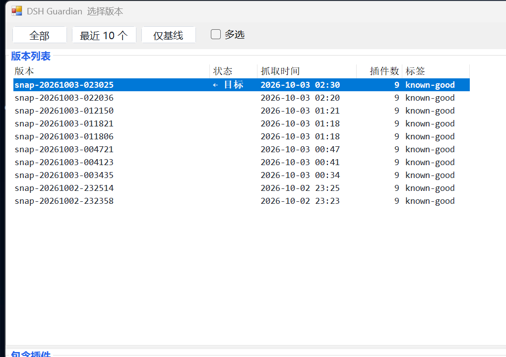
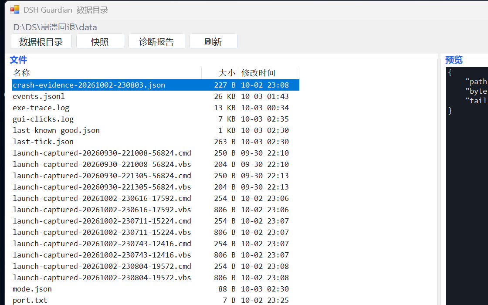

# DSH Guardian 图形界面说明

本文只讲**图形界面**（`dsh-guardian.exe`）。命令行版本仍在 `dsh-guardian-console.exe`，
用法见 [README](../README.zh-CN.md)。

> 日志每一行是什么意思：见 [日志怎么读](LOG.md)。
> 它和旧控制台版的差异、以及为什么换界面：见 [技术文档](TECHNICAL.md)。

---

## 一、界面总览

主窗口分**三个带标题的区**，区名就说明它装什么：

```
┌ 当前状态 ─────────────────────────────────────────────┐  ← ① 现在守没守着
│ ● 监视中   —— 关掉本窗口即停止                        │
│ 上次检查：9 分钟前      回退目标：snap-…-known-good   │
│ 装插件前：先打开监视，并保持本窗口开着。              │
├ 操作 ─────────────────────────────────────────────────┤  ← ② 点这里干活
│ [打基线][开关监视][回退][日志][目录][刷新][放大结果][退出] □关窗后继续监视 │
├ 执行结果 ─────────────────────────────────────────────┤  ← ③ 点完看这里
│ ▶ 开始：打基线                                        │
│ Snapshot to create: …                                 │
│ ✔ 完成                                                │
└───────────────────────────────────────────────────────┘
```


两个对话框：

| 版本选择（点「回退」） | 数据目录（点「目录」） |
|---|---|
|  |  |

**窗口大小与位置会被记住**：下次打开回到你上次放的地方（存在 `data\gui-window.json`）。
若记下的坐标已经不在任何显示器上（拔了外接屏、改了分辨率），**该坐标会被忽略并回退到默认位置**，
日志里会写 `window bounds ignored (off-screen)`。

---

## 二、当前状态区

整个界面最重要的一句：**现在到底有没有在守着。**

| 显示 | 含义 | 颜色 |
|---|---|---|
| `● 监视中（进程 N）—— 关掉本窗口即停止` | 监视器在跑，DSH 崩了会自动回退。勾了「关窗后继续监视」时后缀变成 `—— 关窗后继续监视`；设置与运行中的监视器不一致时附「（设置已改，下次点「开关监视」生效）」 | 绿 |
| `◐ 正在启动监视器… N 秒` | 已下开启指令，监视器还没报到。**N 是真实等待秒数**；正常 1 秒内就会变绿 | 黄 |
| `⚠ 监视器已退出，监视没在跑` | `runtime.pid` 还在但进程已死（例如被任务管理器结束）。**发现即报**，实测 0.42 秒 | 红 |
| `⚠ 监视器没能启动` | 超过 5 秒仍没有监视器。去看「日志」和 `data\exe-trace.log` | 红 |
| `◐ 已开启，监视器启动中…` | 已下达开启指令，监视器还没报到（正常只持续一两秒） | 黄 |
| `○ 未监视   —— 不占用任何资源` | 什么都没跑 | 灰 |
| `⏳ 正在执行：打基线 …` | 有动作在执行中，按钮暂时禁用 | 黄 |

另外两行：

| 行 | 含义 |
|---|---|
| 上次检查 | 最近一次成功探测 DSH 端口的时间。**只要监视开着，它就该是刚刚** |
| 回退目标 | 崩了会退到哪个版本（`snap-…-known-good`）。没打过基线时显示「（未设置）」 |
| `⚠ 还没有基线，崩了没得退。先打基线。` | **警告行**：没有基线时自动回退没有目标可退，此时崩溃只能人工处理 |

### 监视的生命周期：窗口就是开关（默认）

**默认**监视器以 `-ParentPid <本窗口进程号>` 启动，**窗口进程一消失它就自行退出**
（日志记 `resident: exiting (launcher closed)`）。

| 动作 | 默认（不勾设置） | 勾上「关窗后继续监视」 |
|---|---|---|
| 点「开关监视」打开 | 监视器启动（带 `-ParentPid`），状态行先「启动中…」后 `● 监视中（进程 N）` | 监视器启动（**不带** `-ParentPid`） |
| 关掉本窗口 | **监视同时停止**，`runtime.pid` 被清理 | **监视继续跑**，`runtime.pid` 保留 |
| 重开窗口 | 显示 `○ 未监视`，需再点一次 | 显示 `● 监视中`，点「开关监视」才停 |
| 点「开关监视」关闭 | 写暂停标记 → 结束监视器 → 清理 `runtime.pid` | 同左 |
| 监视器活到寿命上限 | 默认 240 分钟，到点自动退出，防止忘记关而永久驻留 | 同左 |

> **为什么默认是"关窗即停"**：只有这样，"程序不会在你不知情的情况下留在后台"这句话才成立。
> 需要长时间盯着（例如夜间跑一轮长测试）时，自己勾上那个开关——代价是关窗后仍有常驻进程，
> 你必须记着回来停它。
>
> 状态行**变化时**会写一行 `status: …` 到 `data\gui-clicks.log`，所以"它到底说了什么"不用截图就能查。
> 刷新节奏是自适应的：**正在监视时每 0.4 秒**、未监视时每 2 秒——因为"已武装"永远不是稳定态，监视器随时可能死，
> 而窗口是唯一会告诉你这件事的东西。
>
> **状态行说的是"正在跑的那个监视器"的真实行为**，不是当前设置。改勾选不会影响已经在跑的监视器，
> 所以两者不一致时状态行会显示真实行为并附上「（设置与运行中的监视器不一致，点一次「开关监视」重新对齐）」。
> 绑定方式记录在 data\watcher-launch.json。
>
> 两种行为不可能同时成立，所以它是个**设置**而不是默认值。设置存 data\gui-settings.json，
> **切换立即生效**：监视开着时改勾选，程序会当场停掉旧监视器、按新设置重建一个（约两秒，结果区会写明），不需要你手动重开一次。

---

## 三、操作区：八个按钮

每个按钮**点一下直接执行**，不需要先选中再确认。文字是两字简称，**鼠标悬停显示完整说明**。

| 按钮 | 点了会发生什么 | 失败时看哪里 |
|---|---|---|
| **打基线** | 运行 `dsh-snapshot.ps1 -Action Mark-Good`，新建 `data\snapshots\snap-<日期时间>-known-good\`（6 个配置文件），并把它设为**回退目标**。旧快照**永不删除、永不覆盖** | 执行结果区的原始输出；`data\snapshots\` 是否出现新目录 |
| **开关监视** | 开 → 启动监视器（`dsh-guardian-console.exe watch-loop`，每 55 秒起一轮 `dsh-watchdog.ps1`）；关 → 写暂停标记并结束它 | 状态行若长期停在「启动中…」，看「日志」和 `data\exe-trace.log` |
| **回退** | 打开**版本选择对话框**（见第五节） | 对话框内的提示；`data\watchdog.log` |
| **日志** | 在执行结果区显示 `data\watchdog.log` 的**末尾 40 行**，并在前面说明这份日志是什么、怎么看 | 日志文件不存在时也会说明它本该在哪 |
| **目录** | 打开**内置文件浏览器**（见第五节） | 预览区会写"文件不存在"或"无法读取" |
| **刷新** | 重新读取 `mode.json`、`last-tick.json`、`last-known-good.json`、`runtime.pid`，立即更新当前状态区 | —— |
| **放大结果** | **收起「当前状态」区**，让执行结果区占满窗口；按钮文字变成「返回」，再点一次还原 | —— |
| **退出** | 关闭窗口。**若正在监视会先弹窗提醒**"退出会同时停止监视：监视器绑定在本窗口上，窗口关闭它就退出。想继续监视就别关窗口。" | —— |

### 按钮为什么这么少

早期版本里同时存在"动作列表"和"按钮"，两者调的是同一批动作——**一个动作两个入口**，
属于界面缺陷。现在只保留按钮。

**「放大结果」只收起状态区，不收起按钮行。** 这一点是刻意的：按钮是"回到原样"的唯一入口，
把它一起藏起来会让人退不出来。

---

## 四、执行结果区

**这一区是排查问题的第一现场**：脚本的原始 stdout、错误信息、以及 `▶ 开始` / `✔ 完成` 标记都在这里。
深色等宽字体，横竖都能滚动（长行不会被截断）。

点下按钮后**立刻有四处变化**，避免"看着像卡死"：

| 位置 | 变化 |
|---|---|
| 状态行 | `⏳ 正在执行：打基线 …`（黄色） |
| 标题栏 | `DSH Guardian  执行中：打基线` |
| 鼠标 | 变成等待样式 |
| 本区 | 出现 `▶ 开始：打基线`，并**自动滚到最新一行** |

动作结束后恢复原状，追加 `✔ 完成` 或 `✖ 失败（退出码 N）`；执行期间按钮禁用，避免重复点击。

**「放大结果」**就是为这一区准备的：收掉状态区后，输出能占满整个窗口高度，
不用去拖窗口边框。

---

## 五、两个对话框

### 版本选择对话框（点「回退」）

```
┌──────────────────────────────────────────────────────────────┐
│ 选中一个版本：现在就回退、只设为以后的目标。要一次删除多个，  │
│ 打开右侧「多选」后勾选（多选仅对删除生效）。                  │
├──────────────────────────────────────────────────────────────┤
│ [全部] [最近 10 个] [仅基线]                    [ ] 多选      │
├─ 版本列表 ────────────────────────────┬──────────────────────┤
│ 版本              状态  抓取时间  插件 标签                    │
│ snap-20261003-004721   ←目标 2026-10-03 00:47  9  known-good  │
│ snap-20261002-230811         2026-10-02 23:08  9  非基线      │
├─ 包含插件 ────────────────────────────┴──────────────────────┤
│ deepseek-harness-plugin-xxx                                   │
├──────────────────────────────────────────────────────────────┤
│ [现在就回退] [只设为以后的目标] [删除所选] [关闭]              │
└──────────────────────────────────────────────────────────────┘
```

| 元素 | 作用 |
|---|---|
| 筛选按钮 | 全部 / 最近 10 个 / 仅基线 |
| **多选** 开关 | 打开后每行出现勾选框。**只影响「删除所选」** |
| 版本列表 | 五列：版本、状态（`←目标`）、抓取时间、插件数、标签。列宽 400/96/200/92/136 |
| **包含插件** | 选中版本**实际含有的插件名**——用来判断"这个版本里有没有我要去掉的插件" |
| 分隔条 | 版本列表与包含插件之间**可拖动** |

| 按钮 | 效果 |
|---|---|
| 现在就回退 | 立刻把 DSH 配置还原到该版本（**再弹一次确认框**） |
| 只设为以后的目标 | 不动现在的配置，只改"崩了退到哪" |
| 删除所选 | 删除勾选（未开多选时是高亮）的快照，**窗口不关** |
| 关闭 | 什么都不做 |

**回退前会自动留底**：当前配置先复制到 `data\snapshots\pre-restore-<时间>\`，
所以回退永远可逆。确认框里也写了这句话。

> **什么时候用「只设为以后的目标」**：先装了插件 A，又装了插件 B，B 把 DSH 搞崩了。
> 目标是"装 A 之前"→ 回退会把 A 和 B 一起去掉；目标是"装 B 之前"→ 只去掉 B。

#### 多选只对删除生效

「多选」是**模式开关**，不是常开行为：

| 开关 | 列表 | 「删除所选」删什么 |
|---|---|---|
| 关（默认） | 普通单选列表 | 当前高亮那一行 |
| 开 | 每行一个勾选框 | 所有勾选的行 |

- 「现在就回退」和「只设为以后的目标」**始终只作用于当前高亮的那一个**，与开关无关
- 关掉开关时**自动清空已勾选项**，不会留下看不见的选择
- 底部会写明当前模式：`共 13 个版本，已勾选 3 个（多选仅用于删除）`

#### 删除：唯一不可撤销的操作，四重保护

1. **删除前单独确认**，确认框列出要删的快照名（超过 8 个则列前 8 个 + "共 N 个"）
2. **只允许删除 `snap-*` 目录**。`pre-restore-<时间>\` 这类留底目录**删不掉**——
   它们是回退失败后的补救手段，误删会让"退回上一次回退之前"变成不可能
3. **删完窗口不关**：列表自动重扫，可以接着删下一批，不用反复重开
4. **自动维护回退目标**：
   - 删的不是当前目标 → 目标不动
   - 删的正是当前目标 → 目标**自动改为剩下的最新一个**，并在输出区写明
   - 删完最后一个 → 指针被清除，此时自动回退**拒绝回退**，直到你重新打基线

取消确认或脚本失败时**列表不动**，不会出现"界面像是删掉了、其实没删"。

删除只影响磁盘上保留了什么，**不会动 DSH 现在的配置**。

命令行等价写法：

```powershell
powershell -File "app\dsh-snapshot.ps1" -Action Delete -Snapshot snap-20261002-232655-known-good
powershell -File "app\dsh-snapshot.ps1" -Action Delete -Snapshot "a,b"   # 多个，逗号分隔
powershell -File "app\dsh-snapshot.ps1" -Action Delete -Snapshot x -DryRun # 只列出会删什么
```

### 数据目录对话框（点「目录」）

```
┌──────────────────────────────────────────────────────────────┐
│ D:\DS\崩溃回退\data                        ← 完整路径         │
│ [数据根目录] [快照] [诊断报告] [刷新]      ← 快速跳转         │
├───────────────────────────┬──────────────────────────────────┤
│ 名称           大小  修改  │  选中文件的内容预览              │
│ [console]            23:08 │                                  │
│ [snapshots]          00:47 │                                  │
│ state.json          1 KB   │                                  │
│ watchdog.log        18 KB  │                                  │
├───────────────────────────┴──────────────────────────────────┤
│ [上一层] [打开] [关闭]        2 个目录，23 个文件             │
└──────────────────────────────────────────────────────────────┘
```

| 元素 | 说明 |
|---|---|
| 路径栏 | 当前目录的**完整路径**（不会截断成 `…`） |
| 快速跳转 | 一键到数据根目录 / `snapshots` / `诊断报告`；「刷新」重新读取 |
| **文件** | 三列：名称、大小、修改时间；`[方括号]` 是目录，蓝色显示 |
| **预览** | 选中**文件**即在右侧显示内容；空文件、超过 200 KB 的文件只提示不预览 |
| 分隔条 | 文件与预览之间**可拖动** |
| **预览放大** | 一键把预览铺满窗口（再点变回「返回列表」），不用去找那条 6px 的分隔条 |
| 状态栏 | 当前目录下有多少个目录、多少个文件 |
| 键 | `Enter` 打开选中项，`Backspace` 返回上一层，双击等同 Enter |

> **为什么不用资源管理器**：这台机器上 `explorer.exe` 直接启动会报 `0xc0000142`
> （应用程序无法正常启动），改用 Shell COM 又报"无法访问指定设备、路径或文件"。
> **同一个手段失败两次之后就不再试第三次**，改为程序自己显示——顺带解决了
> "只想看一眼日志却要开一个资源管理器窗口"的笨重。

---

## 六、快捷键

| 键 | 作用 |
|---|---|
| `F5` | 刷新状态（等同「刷新」） |
| `Esc` | 关闭窗口（等同「退出」，会先询问） |
| `Enter` | 执行。主窗口里执行当前动作；两个对话框里等同「打开」 |

---

## 七、常见问题

**关掉窗口，监视还在跑吗？**
不在跑，已经停了。监视器绑定在本窗口进程上，窗口关闭它就退出
（日志记 `resident: exiting (launcher closed)`）。重新打开界面会显示 `○ 未监视`，
需要再点一次「开关监视」。

**状态行一直显示"已开启，监视器启动中…"？**
监视器启动后需要一轮才会写入 `runtime.pid`。超过一分钟仍如此，去看「日志」，
或检查 `data\exe-trace.log`。

**自动回退会不会把我好好的 DSH 退掉？**
门槛是「**启动崩溃循环被证实**」；另外**同一份配置绝不会被回退两次**，还有次数硬上限。
判定期间每 30 秒写一行"仍在启动窗口内，暂未下结论"，不会看起来像卡住。

**反悔了怎么办？**
每次回退前都有 `pre-restore-<时间>\` 留底，用「回退」把它选回来即可。

**手动打基线和监视器自动回退会冲突吗？**
不会。监视器只用 `last-known-good.json` 指定的那一个目标；打基线会更新这个指针，
所以"装完插件确认正常 → 再打一次基线"就是正确的日常流程。

**输出区出现 `[退出码 N]` 是什么意思？**
脚本返回了非零值。上面的原始输出就是原因；把这一段贴出来即可定位。

**为什么回退要等那么久？**
默认引导窗 `-BootWindowSeconds` 是 90 秒：一次启动必须走完整个窗口才会被算作"短命启动"，
这是为了不把"启动慢但没事"误判成崩溃。嫌慢可以调小，前提是你的 DSH 正常时不需要那么久。

> **轮次间隔必须大于引导窗**（`-IntervalSeconds > -BootWindowSeconds`）。
> 否则每轮都被判为"仍在引导窗内"，启动次数累积不起来，**崩溃循环永远无法成立**，
> 自动回退也就永远不会触发。

### 按钮点了没反应怎么查

程序把界面上真正收到的每一次点击写进 `data\gui-clicks.log`：

| 日志行 | 含义 |
|---|---|
| `form loaded, action buttons=8` | 界面建好了，八个按钮都在 |
| `click: 打基线  busy=False actionsEnabled=True` | **点击确实到达了按钮** |
| `handler threw: …` | 点击到了，但动作内部抛异常（含完整堆栈） |
| `selftest: entering RunAction(5)` | 自测模式下动作开始执行 |

- 文件里**没有** `click:` 那行 → 点击根本没送到按钮上（输入问题，不是动作问题）
- 有 `click:` 但没有后续输出 → 动作本身出错
- 程序自身崩溃会另写 `data\gui-crash.log`

这条日志是为"按钮无反应"这个具体故障加的：在那之前只能靠推理，而推理错过两次。

---

## 八、相关文档

| 想知道 | 看 |
|---|---|
| 日志每一行是什么意思 | [日志怎么读](LOG.md) |
| 完整使用说明、常见问题 | [使用说明](GUIDE-zh.md) |
| 编码陷阱、判定规则、CLI | [技术文档](TECHNICAL.md) |
